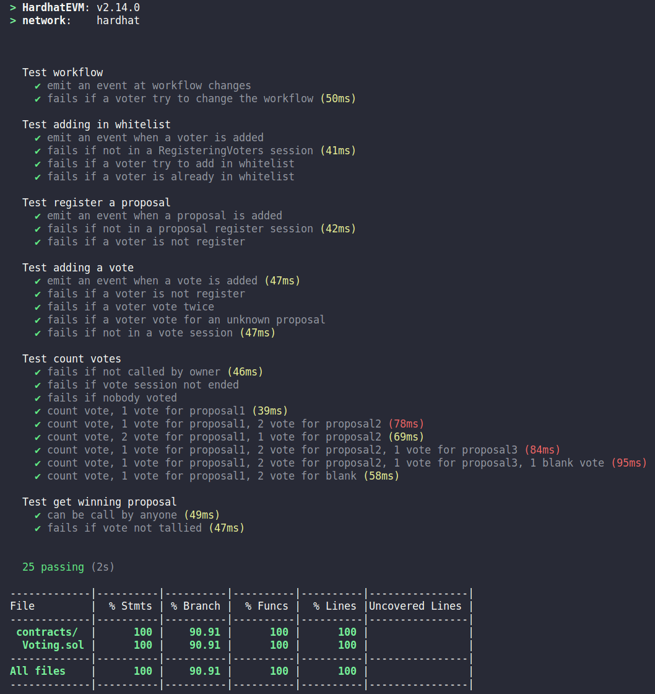

# Projet - Système de vote

Projet réalisé sur hardhat et compatible Remix

Gestion du vote blanc, les votes blancs sont pris en compte dans le décompte du vote.

Lancement de test unitaires avec la commande:

```shell
npm run coverage
```


